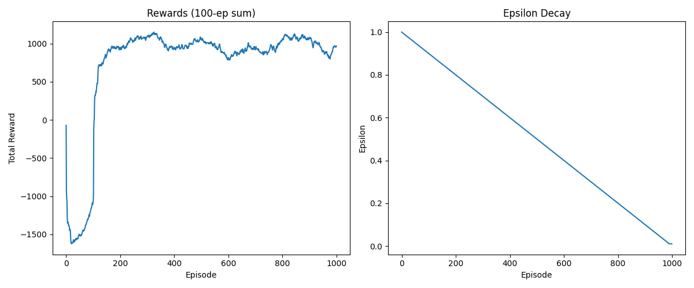

# GridWorld DQN

A Deep Q-Learning (DQN) implementation on a custom GridWorld environment with dynamic obstacles.

The agent learns to navigate from the top-left corner to the bottom-right corner of a 4x4 grid while avoiding randomly placed obstacles (attacks).

## Environment

```
S . . .
. . . .
. . . .
. . . G
```

- `S` = Start position (0,0)
- `G` = Goal position (3,3)
- 2 random obstacles placed every episode

### Rewards

| Situation | Reward |
|---|---|
| Reach goal | +25 |
| Hit obstacle | -15 |
| Hit boundary | -5 |
| Normal move | -1 |

### Actions

| Action | Direction |
|---|---|
| 0 | Up |
| 1 | Down |
| 2 | Left |
| 3 | Right |

## Project Structure

```
gridworld_dqn/
├── main.py           # training loop + plotting
├── environment.py    # custom GridWorld environment
├── model.py          # DQN neural network
├── agent.py          # replay buffer + select_action + optimize
├── config.py         # all hyperparameters
└── requirements.txt
```

## Setup

```bash
pip install -r requirements.txt
```

## Run

```bash
python main.py
```

Training runs for 1000 episodes. Progress is printed each episode and a final plot is saved to `gridworld_plot.png`.

## Results

The agent typically learns to reach the goal consistently by episode 100-200. The reward graph shows a sharp jump from negative to positive rewards at this point.



## Hyperparameters

| Parameter | Value |
|---|---|
| Episodes | 1000 |
| Batch size | 32 |
| Memory size | 1000 |
| Hidden nodes | 64 |
| Learning rate | 0.001 |
| Gamma | 0.9 |
| Epsilon start | 1.0 |
| Epsilon end | 0.01 |
| Target sync | Every 10 steps |